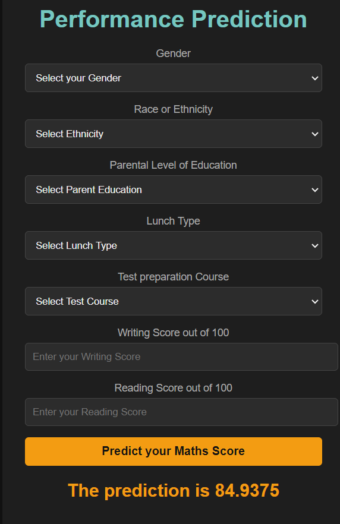

# Student Performance Prediction

## Overview

The Student Performance Prediction project aims to predict students' math scores based on various features such as gender, ethnicity, parental level of education, lunch type, test preparation course, reading score, and writing score. This project utilizes machine learning models to generate accurate predictions and provides a web interface for user interaction.

## Project Structure

The project is organized as follows:

```plaintext
student-performance-prediction/
│
├── data/
│   ├── student-mat.csv
│   └── student-por.csv
│
├── notebooks/
│   ├── data_preprocessing.ipynb
│   ├── model_training.ipynb
│   └── model_evaluation.ipynb
│
├── src/
│   ├── preprocess.py
│   ├── train.py
│   └── evaluate.py
│
├── main.py
├── app.py
├── Dockerfile
├── requirements.txt
├── setup.py
└── README.md
```

## Installation

### Clone the Repository

```bash
git clone https://github.com/your-username/student-performance-prediction.git
cd student-performance-prediction
```

### Set Up a Virtual Environment

Create and activate a virtual environment:

```bash
python -m venv venv
source venv/bin/activate  # On Windows use `venv\Scripts\activate`
```

### Install Dependencies

Install the required Python packages:

```bash
pip install -r requirements.txt
```

## Running the Application

### Web Application

To start the Flask web application, run:

```bash
python app.py
```

Navigate to `http://127.0.0.1:5000/` in your web browser to access the application. Fill out the form to predict the student's math score.

### Model Training and Evaluation

To train and evaluate the model, run:

```bash
python main.py
```

This script will handle data ingestion, preprocessing, model training, and evaluation.

## Models Used

The following machine learning models are utilized in this project:

- **Random Forest**: `RandomForestRegressor()`
- **Decision Tree**: `DecisionTreeRegressor()`
- **Gradient Boosting**: `GradientBoostingRegressor()`
- **Linear Regression**: `LinearRegression()`
- **XGBRegressor**: `XGBRegressor()`
- **CatBoosting Regressor**: `CatBoostRegressor(verbose=False)`
- **AdaBoost Regressor**: `AdaBoostRegressor()`

## Usage

### Web Interface

1. Open your browser and visit `http://127.0.0.1:5000/`.
2. Complete the form with the student's details and submit.
3. The predicted math score will be displayed on the same page.

### Scripts

- **`main.py`**: Handles data ingestion, preprocessing, model training, and evaluation.
- **`app.py`**: Runs the Flask application for user interaction.

## Screenshots

### Web Application

**Home Page:**




## Contributing

We welcome contributions to improve the project. To contribute:

1. Fork the repository.
2. Create a new branch for your feature or bugfix.
3. Make your changes.
4. Submit a pull request with a clear description of your changes.

## License

This project is licensed under the MIT License. See the [LICENSE](LICENSE) file for details.

## Acknowledgements

- [Scikit-Learn](https://scikit-learn.org/stable/) for machine learning algorithms.
- [Flask](https://flask.palletsprojects.com/en/2.0.x/) for web application framework.
- [Pandas](https://pandas.pydata.org/pandas-docs/stable/) for data manipulation.
- [NumPy](https://numpy.org/) for numerical operations.

## Contact

For any questions or issues, please contact:

- **Author:** Riyaz
- **Email:** riyazmullaji02@gmail.com

